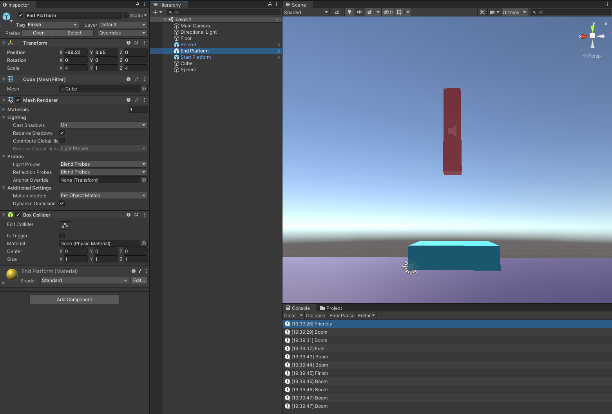
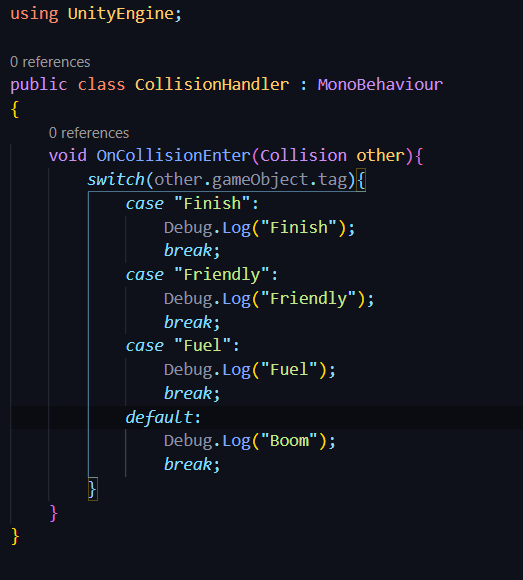

# DEV-09, Switch Statements
#### Tags: [tags]

## Unity

+ Gave tags to things like the End Platform (finish), Start Platform (friendly) and the sphere (fuel) so that we can recognize what type of object we run into via tags.

## Script

