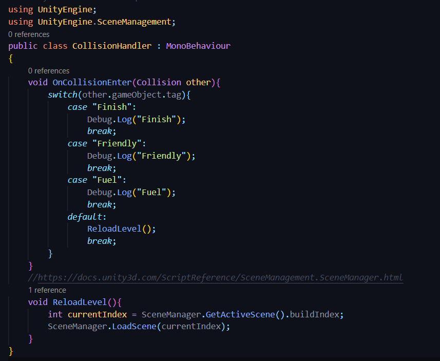

# DEV-10, Respawn Using Scene Manager
#### Tags: [scenes, respawning]

## Script

## Unity

+ When the scene reloads, the lights go out

        Please go to Window > Rendering > Lighting Settings and click on "Generate Lighting". May need to Disable "auto-generate lighting" if applicable. Otherwise, it might be that you'll have to wait several minutes each time you change the lighting in your scene or move something around.