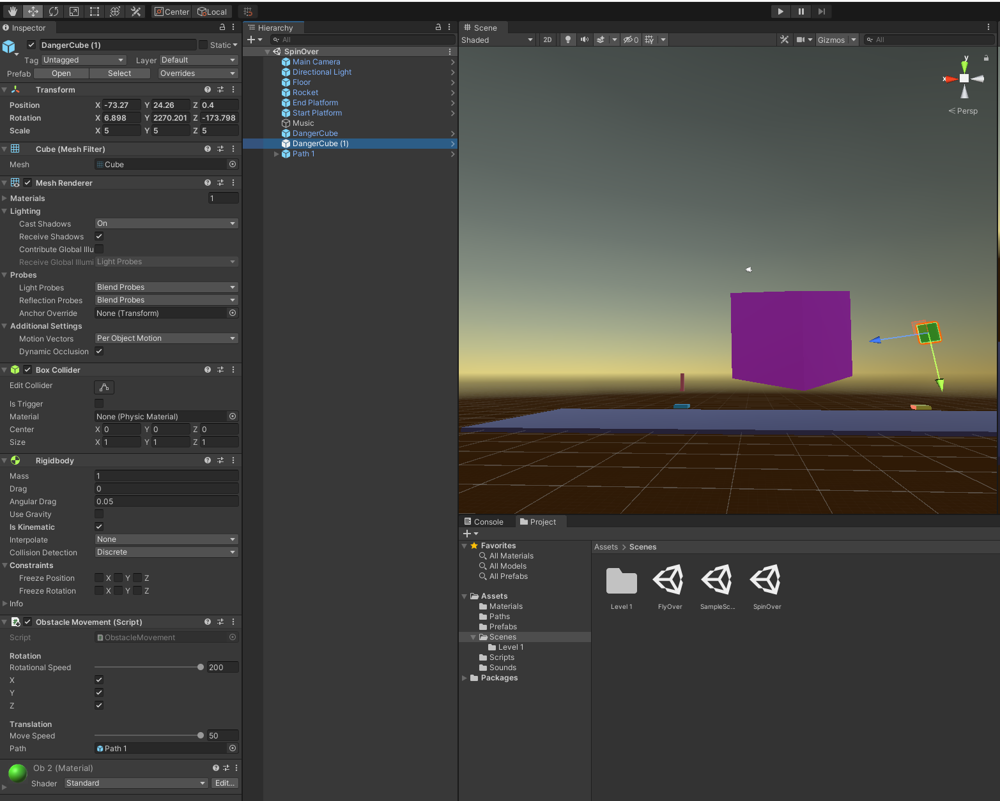

# DEV-11, Load Next Level
#### Tags: [waypoints, moveTowards]

### Scripts

    public class CollisionHandler : MonoBehaviour
    {
        void OnCollisionEnter(Collision other){
            switch(other.gameObject.tag){
                case "Finish":
                    NextLevel();
                    break;
                case "Friendly":
                    Debug.Log("Friendly");
                    break;
                case "Fuel":
                    Debug.Log("Fuel");
                    break;
                default:
                    ReloadLevel();
                    break;
            }
        }
        //https://docs.unity3d.com/ScriptReference/SceneManagement.SceneManager.html
        void ReloadLevel(){
            int currentIndex = SceneManager.GetActiveScene().buildIndex;
            SceneManager.LoadScene(currentIndex);
        }

        void NextLevel(){
            int nextIndex = SceneManager.GetActiveScene().buildIndex + 1;
            if( nextIndex <= SceneManager.sceneCount){
                SceneManager.LoadScene(nextIndex);
            }else{
                SceneManager.LoadScene(0);
            }
        }
    }

#
    public class WayPoint : MonoBehaviour
    {
        public Vector3 GetPosition(){
            return transform.position;
        }
    }
#
    public class ObstacleMovement : MonoBehaviour
    {
    [Header("Rotation")]
    [SerializeField] [Range(1f, 200f)] float RotationalSpeed = 115;
    [SerializeField] bool x = false;
    [SerializeField] bool y = false;
    [SerializeField] bool z = false;

    [Header("Translation")]
    [SerializeField] [Range(1f, 50f)] float moveSpeed = 2f;
    [SerializeField] GameObject path;
    List<Vector3> vectors;
    int currentVector = 0;
    
    void Start()
    {
        vectors = GetAllWayPointVectors();
    }

    void Update()
    {
        Rotation();
        Travel();
    }

    private void Rotation(){
        int ix = x ? 1 : -1;
        int iy = y ? 1 : -1;
        int iz = z ? 1 : -1;
        Vector3 objRotation = new Vector3(1 * ix, 1 * iy, 1 * iz);
        transform.Rotate(objRotation * RotationalSpeed * Time.deltaTime);
    }

    private void Travel(){
        if(currentVector < vectors.Count){    
            Vector3 targetPosition = vectors[currentVector];
            float MovementThisFrame = moveSpeed * Time.deltaTime;
            transform.position = Vector3.MoveTowards(transform.position, targetPosition, MovementThisFrame);
            if(transform.position == targetPosition){
                currentVector++;
            }
        }else{
            currentVector = 0;
        }
    }

    private List<Vector3> GetAllWayPointVectors(){
        List<Vector3> vectors = new List<Vector3>();
        var wayPoints = path.GetComponentsInChildren<WayPoint>();
        return wayPoints.Select(wayPoint => wayPoint.GetPosition()).ToList();
    }
}

### Unity

