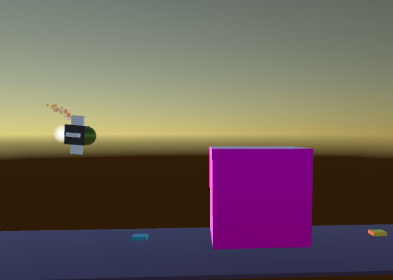
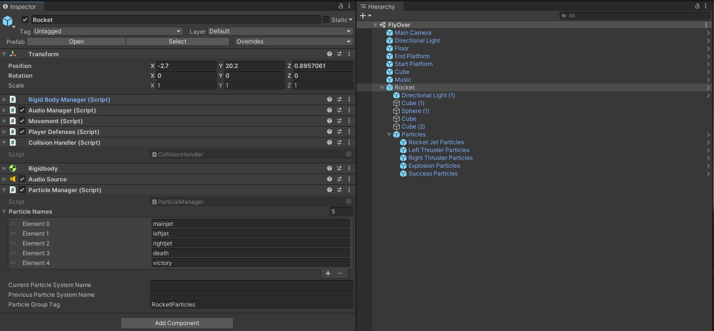

# DEV-15, How to trigger Particles
#### Tags: [Particles]

## Unity

+ Have rockets to the side
+ main thrust rocket
+ explosive death
+ success confetti

## Scripts Created ParticleManager to handle muliple particles of a gameObject

    using System.Linq;
    using System.Collections;
    using System.Collections.Generic;
    using UnityEngine;

    public class ParticleManager : MonoBehaviour
    {
        [SerializeField] List<string> particleNames;
        [SerializeField] string currentParticleSystemName;
        [SerializeField] string previousParticleSystemName;
        ParticleSystem currentParticleSystem;
        ParticleSystem previousParticleSystem;
        [SerializeField] string ParticleGroupTag = "";
        Dictionary<string, ParticleSystem> dictionary;
        
        void Start(){
            dictionary = Zip();
        }
        public void Emit(string particleName){
            if(dictionary.ContainsKey(particleName)){
                ParticleSystem particleSystem = dictionary[particleName];
                currentParticleSystemName = particleName;
                currentParticleSystem = particleSystem;
                Start(currentParticleSystem);
            }else{
                Debug.Log($"particleName: {particleName} does not exist in the dictionary");
            }
        }

        public void StopEmit(string particleName){
            if(dictionary.ContainsKey(particleName)){
                ParticleSystem particleSystem = dictionary[particleName];
                Stop(particleSystem);
            }else{
                Debug.Log($"particleName: {particleName} does not exist in the dictionary");
            }
        }

        public string GetCurrentParticleSystemName(){
            return currentParticleSystemName;
        }

        public ParticleSystem GetCurrentParticleSystem(){
            return currentParticleSystem;
        }

        public void Start(ParticleSystem ps){
            var em = ps.emission;
            em.enabled = true;
            ps.Play();
        }
        public void Stop(ParticleSystem ps){
            if(ps.isEmitting){
                ps.Pause();
                ps.Clear();
            }
        }

        private Dictionary<string, ParticleSystem> Zip(){
            var particleGroupGameObject = GameObject.FindGameObjectsWithTag(ParticleGroupTag)[0];
            var particleSystems = particleGroupGameObject.GetComponentsInChildren<ParticleSystem>();
            if(particleNames.Count > 0){
                var zipped = particleNames.Aggregate(new Dictionary<string, ParticleSystem>(), (dictionary, name) => {
                    int index = dictionary.Count;
                    dictionary.Add(name.ToLower(), particleSystems[index]);
                    return dictionary;
                });
                return zipped;
            }
            else{
                Debug.Log("particleNames Count and particleObject Counts are not the same.");
                return  null;
            }
        }
    }
