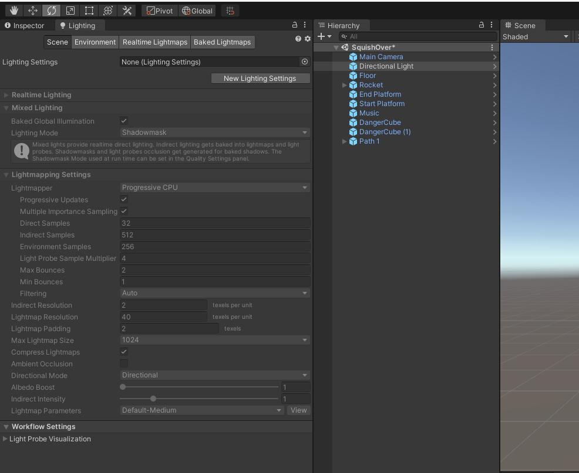
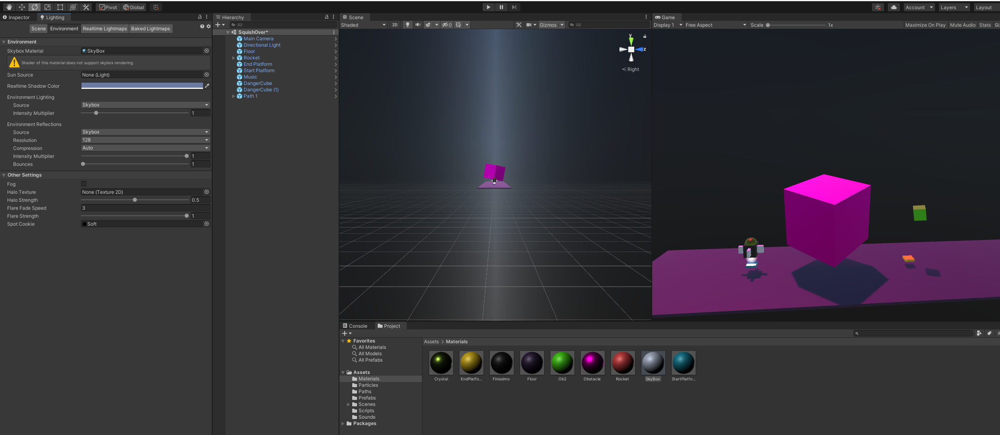
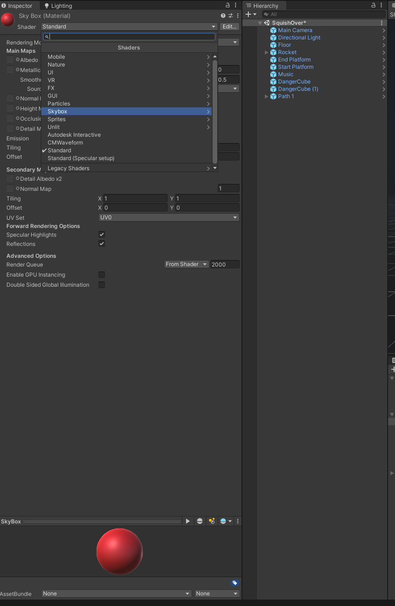
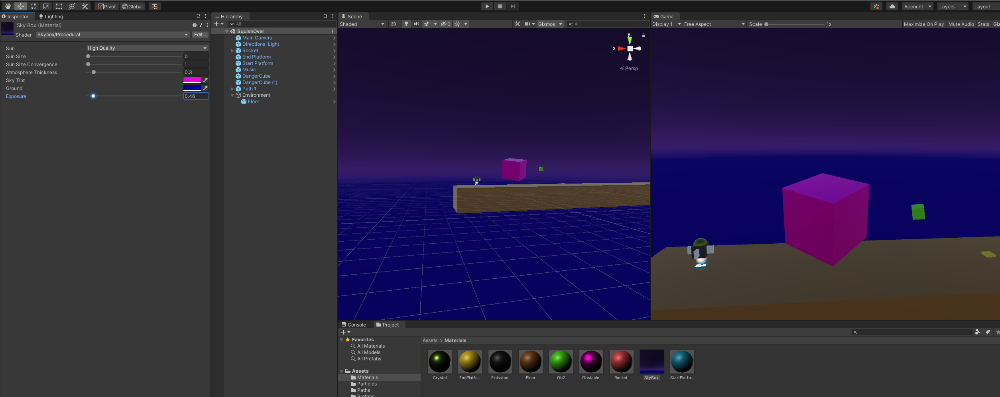

# DEV-16, How to change Lighting
#### Tags: [Lighting]

## Unity

`Window > ZRendering > Lighting`

+ Then go to the Environment Tab and add your material into the Skybox material

+ To make sure the material is applied correctly, select `Skybox/Procedural`

